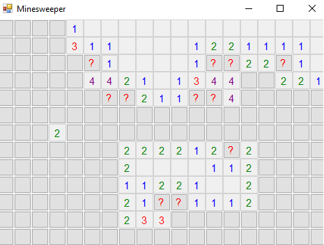

# Minesweeper

A customizable game of minesweeper, open to user definition written in VB.NET. In this windows game, the player is able to custom set the grid width, height, and number of bombs deployed in a traditional minesweeper game.

  

